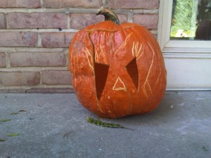
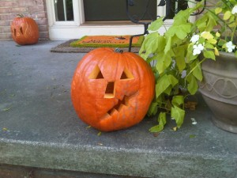
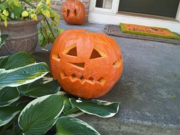
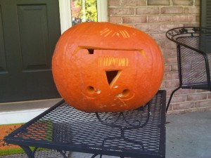

We picked Anna up at the airport yesterday then headed off to Acme (yep, Acme) to pick up pumpkins. They had them on sale for $2.99 and being unemployed (or almost unemployed) we're trying to spend a little as possible on them.

We picked up 4 pumpkins, all rather large and headed home with them. When we got home, we realized that Anna's was cracked in a big way and mine had a crack around the bottom.

Well, it was too late to take them back (we were too lazy actually) so we went ahead and carved them.

Anna's couldn't be carved very well (very hard to cut for some reason) and since it had a huge crack in it there wasn't much she could do with it.

\[caption id="attachment\_326" width="300" caption="Anna's Sad and Demented Pumpkin"\]\[/caption\]

Elizabeth's had a big dent across the face. Elizabeth suggested that we cut the mouth into the crease and it turned out really well.

\[caption id="attachment\_327" width="300" caption="Elizabeth's Pumpkin"\]\[/caption\]

August's pumpkin has a cool mouth and HUGE ears.

\[caption id="attachment\_328" width="300" caption="August's Pumpkin"\]\[/caption\]

Since mine was broken on the bottom, I just cut out the bottom then carved my pumpkin upside down. It took Anna forever to understand what I was doing. She assumed that I was just going to turn the pumpkin over (on top of a candle) but what I was really doing was carving it so the face would be upside down  while on display.

\[caption id="attachment\_329" width="300" caption="John's Pumpkin"\]\[/caption\]
