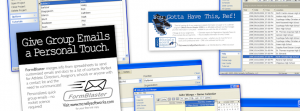

I have been wanting to create something visual to add to the top of this site, plus I needed something for my personal and business Facebook pages. For some reason a random thought popped into my head today - use Picasa to create the image. Picasa (a free image album management application from Google) allows you to select a bunch of pictures and create a random collage from the photos. You can see one of the ones I created at the top of this page - you'll notice I found a way to get a soccer ball in there as well as bacon - plus a bunch of photos of the kids. I need more pics of Anna - need to get some of her in there.

You can also see the one I very quickly created for McNelly SoftWorks below. Click on the photo to view it full size. Pretty cool stuff.

\[caption id="attachment\_2354" align="alignnone" width="300"\] McNelly SoftWorks Collage\[/caption\]
