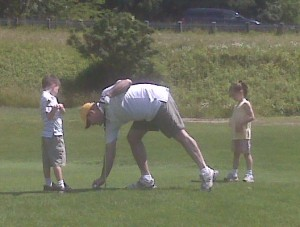
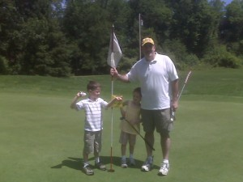
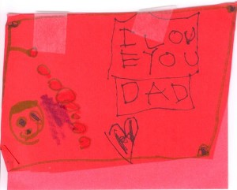
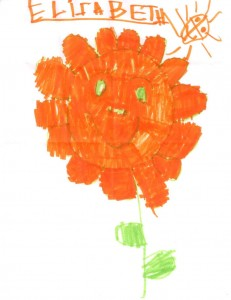

So today is the first father's day I have ever spent with my kids. Every year, Anna has them in Houston visiting with her family. It was never on purpose, but it always worked out that way. Yesterday we took the kids to the driving range then out to play miniature golf. Today, since it was my day, we all went golfing. It was amazing fun. They both did pretty well and August already wants to golf again!

\[caption id="attachment\_179" align="alignleft" width="300" caption="On the Green"\]\[/caption\] \[caption id="attachment\_180" align="alignleft" width="300" caption="Par for Everyone!"\]\[/caption\] \[caption id="attachment\_182" align="alignleft" width="300" caption="August"\]\[/caption\] \[caption id="attachment\_183" align="alignleft" width="231" caption="Elizabeth Father's Day Card"\]\[/caption\]
