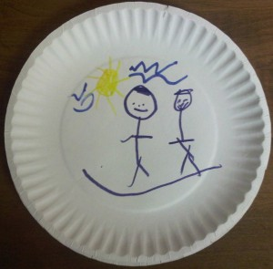
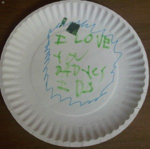

I've been pretty sick for the last couple of weeks - I'm not going to go into what's wrong with me, but I have been pretty miserable. I've been sleeping a lot and when this all first started, August and Elizabeth were really cute in the way they tried to help take care of me (August especially). As I lay in bed, trying to recover I heard something happening at the bedroom door - it sounded like something trying to make its way underneath the closed door.

When I finally got out of bed, there was a wrapped package from August (he'd wrapped it weeks ago and put it under the Christmas tree). When I opened it, I found two paper plates August had decorated - here's pictures of the plates:

I'm pretty sure the first one is of me and August together.

Very cool - made me all misty!
