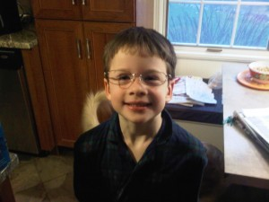
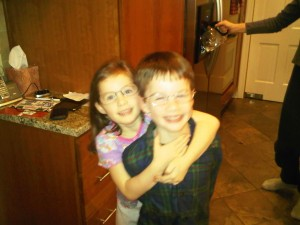
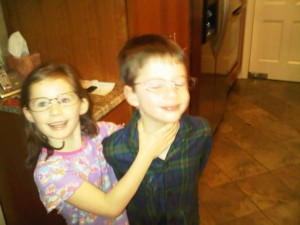

So, I've had to wear reading glasses for the last couple of years. As I've gotten older, they've just not been working very well for me lately. At the same time, August has been bugging me over and over and over again about wanting his own pair of glasses. I told him that once I got new reading glasses, that I'd give him my old ones. Well, because of the nature of AT&T's benefits, I'm going to have to wait until next year to get in to see my eye doctor, so he was having to wait a long time. I finally decided yesterday that I just couldn't wait anymore - so we all headed over to Sam's Club to pick up a 4 pack of stronger reading glasses (I need 4 pair - one for the master bathroom (reading room), my travel bag, my workshop and my office).

Well, the kids couldn't wait for me to open them and I quickly opened the package (very hard to do without breaking the glasses inside) and distributed the new ones to their hiding places. I pushed out the lenses on two old pair and gave them to the kids to wear. I think August has been wearing these lenseless glasses for a full 24 hours, Elizabeth not as much. Here is a picture of August wearing his:

\[caption id="attachment\_387" align="alignnone" width="300" caption="August in Empty Reading Glasses"\]\[/caption\]

And here are some blurry ones of both of them (they just wouldn't sit still for the photo).

\[caption id="attachment\_388" align="alignnone" width="300" caption="The Twins in Empty Reading Classes #1"\]\[/caption\]

\[caption id="attachment\_389" align="alignnone" width="300" caption="The Twins in Empty Reading Classes #2"\]\[/caption\]

Oh what fun it is to be a parent of twins!
