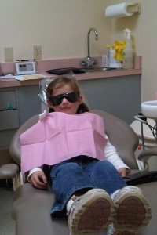

We took the twins to the Dentist yesterday - both parents go when possible (easy now since I'm not working) and the kids pick who goes in with them. Yesterday, Elizabeth wanted me and August went in with Anna. I was really surprised when the whole thing took 75 minutes.

Anyway, Elizabeth got into the chair and told the dental hygienist that she didn't like the bright light in her eyes. Well, Beth (the hygienist) immediately offered Elizabeth these roll-up sun glasses. When I saw her sitting in the chair, I had to laugh at how silly it looked. Here's a picture:

Of course I had to complain - I've been going to that Dentist for more than 10 years (even played golf with him this summer) and I'd never been offered the glasses. How rude! And, to make matters worse, Elizabeth got Cinnamon Roll tooth paste - I LOVE cinnamon rolls! Why don't I get that kind when I'm there?  I'm really getting the short end of the stick here!

Now, before you lambaste me for my attitude: I'm just telling a story here, it's really not all about me. I promise.
