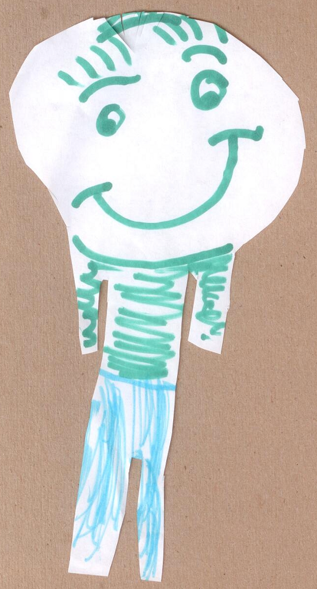

For some reason I've been able to read a lot of books lately. It's probably because lately I've been spending a lot of time on the front porch watching the kids play with the neighbors and I usually take a book out with me. I've said this before, but the neighborhood is WONDERFUL and the kids have a lot of fun playing with the neighbors. I usually let them roam free (Anna's a little uncomfortable with this) and just sit on the front porch so I can see what's going on as they run from house to house to house.

Anyway, I've had this huge collection of books I've purchased but not read and I'm making a bug dent in them. Just in case you're interested, I'm publishing my reading list through Amazon's book list application on LinkedIn (http://www.linkedin.com/in/jwargo23 - you'll have to be linked to me to be able to see the list). The other day Elizabeth made me a bookmark to use when I'm reading. Here's a picture of it - I love it.
