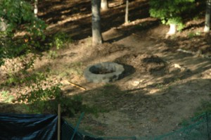

We have these crappy little blocks the previous owner used to build some stairs down into the back yard. They were used to build the walls for the stairs and some rocks were dumped into the area to make the floor. Didn't like it and couldn't wait to get rid of them. We asked the builder to put all of the blocks and rocks into the fill for the new garage and that's likely to happen today.

This last weekend, I suggested that we take some of the blocks and make a fire pit down/back in the woods in my back yard. My back is out (9 days now) so Elizabeth worked one block down into the back and Anna carried/rolled another 23 of them down. The blocks lay perfectly into a little circle, so now we have a nice fire pit to use this fall/winter.  Here's a pic (I dropped the camera, so it no longer focuses - probably explains the blurriness of the picture).

\[caption id="attachment\_615" align="alignnone" width="300" caption="The Fire Pit"\]\[/caption\]
