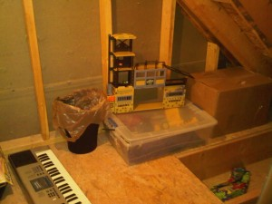

Our new house has a lot of storage. When we first looked at it, it kept me awake the first night because I knew I loved the house, but I couldn't think of how, since the house didn't have a basement, we would be able to get all of our stuff put away. We went back the next day and I took an inventory of the storage space and quickly found that we had enough (probably too much).

Each of the upstairs front rooms have dormers and to either side of the dormers are storage rooms (with little half doors). Augusts' room has two of them, but they're unfinished (as shown in the figure below).

\[caption id="attachment\_470" align="alignnone" width="300" caption="One of the Storage Closets"\]\[/caption\]

I promised August that we'd cover the walls in the storage rooms (August uses one of them as a little play room as you can see) and he's been bugging me ever since we got here to get started on the project. Today I pulled out the back seats in the van, put a booster seat in the front seat and August and I headed to Home Depot to buy some drywall.

What was funny, and perhaps another story to tell here, was how August and I spent the whole trip there trying to come up with all of the compound words we could think of (his idea). We had 'drywall' of course, fireman, firetruck, dogwood and many more - it was a ton of fun!

Anyway, the van was just a few inches short of the 8' we needed to store the sheets of drywall, so a nice guy at Home Depot (a very nice guy actually) helped cut them in half so they'd fit. August helped out too and before we knew it we had what we needed loaded up in the car.

I'm going to take a couple of days off next week and use one of them to hang the drywall.  I'll post pictures when it's done. Stay tuned.
