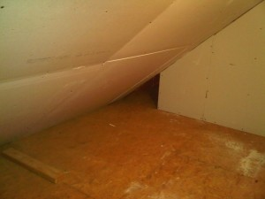

The kids were on spring break this week and I took Thursday and Friday off to spend some time with the kids and to work on hanging the drywall in those two storage areas in August's bedroom. August and I did the smaller one on Thursday then Anna and I did the larger one on Friday. I didn't do a great job, but it's functional and the kids can no longer bang their heads on exposed nails when in the room. It was really a lot of fun - Anna did a better job than I did on the corner cuts.  Here's a picture of the larger storage room all finished up.

August wants to tile the smaller room, so hopefully August and Anna will get to that soon.
