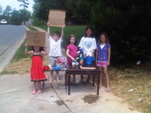

Anna had a sorority reunion this weekend, so I had the kids all to myself all weekend. On Sunday, we were hanging out, playing in the yard and so on. Before long it was lunch time and I had a house full of kids. August and Elizabeth had been bugging us ever since we got here to let them sell lemonade in the front yard and they asked me again. Well, it was a hot one; it got up to 92 degrees, so I told them they could do it after lunch.

Before I knew it, I was dragging my kids and a neighbor’s kids into the house for lunch. August decided he would take everyone’s orders and serve lunch to everyone. I had a really hard time making him understand that he was a waiter, not a waitress.  He would take orders, get the stuff together and I’d help make the sandwiches. He’d pour drinks, spread peanut butter on bread and all the things he needed to do. It was too cute.

After lunch, we all worked together to make a pitcher of lemonade and signs. We dragged a couple of tables outside, collected cups from different houses and got to work.  We setup on the corner so we could get access to cars from the maximum number of directions (three in our case) and got to work. A little while later another neighborhood friend came by and hopped out to help.

\[caption id="attachment\_546" align="alignnone" width="300" caption="Lemonade Stand"\]\[/caption\]

A whole lot of people stopped and bought lemonade. Those that didn’t at least drove by with a big smile on their face. Our local Carolina Panther (that’s American Football for those of you who don’t know) neighbor stopped on his cool, three-wheel motorcycle and tossed over $20 for the kids (didn’t take any lemonade). In all, the kids took in $40 and had a great time doing it (it proably cost me about $5 in materials – which I didn’t get back). We took all of the money into the house and sat at the table to split it all up. August suggested that everyone make a bank out of green plastic cups, so everyone had their own, special place to put their earnings.

I’m sure we’ll be doing it again soon. Anna promised to make some cookies or Rice Krispie Treats to add some food to the list of sale items. Could be fun.
