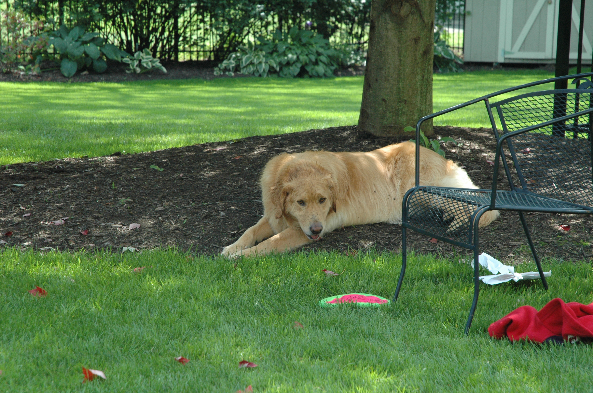

Lucy's our big, not too bright golden. She's not feeling very well this afternoon - she threw up earlier and wouldn't eat her dinner (that never happened before). She's been camping out behind my office chair as I sat on conference calls, her comfort place as it were. During my last call, she got up, walked over to the stairs and threw up her breakfast (it's 5 PM, so it's been in there for a while). I was on a call, so I couldn't do anything about it so I left it there. After the call, I got up to clean up the mess only to find that it was no longer there - she'd eaten it.  Yuck. I wish I couldn't have gotten to it in time to pick it up, I'm sure she isn't feeling any better with the food back in her sick stomach.

See, I told you she wasn't too bright.
