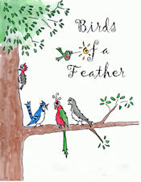

\[caption id="attachment\_421" align="alignleft" width="175" caption="Birds of a Feather"\]\[/caption\]

Anna's sister is an elementary school teacher and she and a friend recently created a school program for elementary school kids called Birds of a Feather. Its a great program with great songs and costumes. Anna even created the program cover drawing.

They created a company called Singin' a Song Productions to market and sell the program to teachers and are attending a HUGE conference this weekend to promote the program. Anna and I created the web site for her company, you can read more about the program at [www.singinasong.com](http://www.singinasong.com "Singin' a Sing Productions"). If you know of a music teacher who would be interested, please pass the information along.
