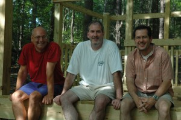
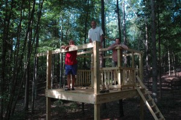

Well, my brother and sister came up for the weekend to help with building the fort. We spent the whole day Saturday cutting and screwing in all of the parts and ended up with a play fort that Anna nicely said 'this turned out much better than I thought it would - it looks like it was built by a professional, like something you'd see in a magazine.

Here's the building crew:

\[caption id="attachment\_582" align="alignnone" width="300" caption="Three Builders"\]\[/caption\]

And here we are climbing on the fort:

\[caption id="attachment\_583" align="alignnone" width="300" caption="Three Builders Climbing"\]\[/caption\]
