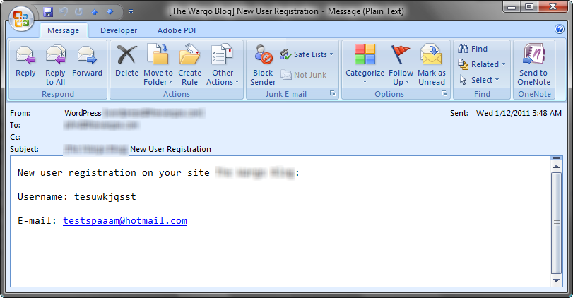

I run a WordPress blog and setup the registration option so friends and family (especially my last remaining Aunt) can know when I post new items to the blog. I setup the system to notify me when someone registers and it's funny to see the different spammers register for the system. Usually the user name they enter doesn't look anything like the email address - that's usually a good clue for me that it's a spammer. You'd think that the user name someone selects would match their primary email address, but that's not what they usually do. I haven't tested this, but I'm sure the email addresses are bogus - too funny though how many of them end in .ru.

You've got to love it though when spammers register for your site and clearly identify themselves as spammers. Take a look at the following screen shot:

The person registered for the site and the email address they're using tells it like it is: someone testing some spamming software.

WordPress has a pretty cool system that blocks spammers from posting stuff to your blog. I use dto use the Nucleus CMS for my blog and one time I had hundreds of spam comments on all sorts of areas in my blog. With WordPress, blocking those guys is automatic, you enable the module and it keeps the bad stuff out.

You'll notice that I'm not doing what most people do and spell spam with all capital letters. A lot of folks out there think Spam is an acronym when really all it is is a tasty breakfast meat. It's just a word, nothing to get all capitalized about.
