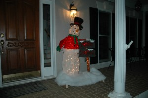

We had a big holiday weekend here. I’ve been out of town most of the last 6 weeks and it was really nice to have a few extra days without work. We had the traditional Thanksgiving dinner Thursday then Friday and Saturday I crossed a few things off the to-do list.

On Saturday I:

- fixed the toilet in the kid’s bathroom
- disassembled Elizabeth’s sink to clear a slow drain
- mounted a can crusher in the garage
- rehung a cabinet shelf in the den and more
- Replaced a light fixture in the kitchen

Today I got caught up on some paperwork in my office then went into the workshop to build a stand for a holiday snowman we got years ago. He came with stakes you could use to stake him into the ground, but it wasn’t substantial enough to keep him standing. I grabbed some 2x4’s and built my own little stand for him. Of course, Anna laughed at my efforts – called it over-engineered, but the snowman is standing up and won’t likely ever fall down.

His right arm is broken, so I had to go get a dowel so we can put it back together.

Through Anna’s laughter, she suggested that we get some fake snow to put on the ground around my cool and amazing stand – here’s a picture:

We also took some pictures of the kids and dogs for our yearly Christmas card. 150 pictures later, we may have one we’re able to use for the card. We’ll see what happens.
