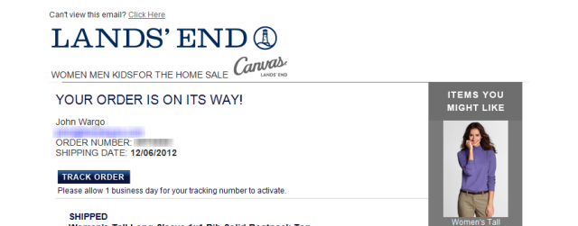
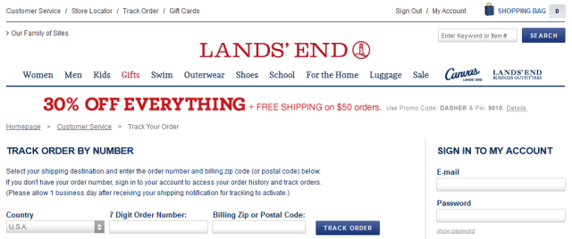

I’m a huge fan of Lands’ End (yes, that’s a typo – it’s their typo, not mine) and have been a customer for a very long time. Everyone’s on the Internet now, so you can buy things, check status of orders and even return stuff without ever having to fill out a form or even call a customer service person.

Why is it then that Lands’ End won’t give you an easy way to track your order?

I got an email from them for an order I placed (shhhhh, it’s a gift for my Wife) that included the track order button shown in the figure below:

Figure 1 – Lands’ End Shipped Order Confirmation Email

Being interested in knowing where said order was, I clicked the Track Order button and was presented with the following page:

Figure 2 – Lands’ End Track Order Page

Help me understand why they’re prompting me to enter my order number? They already know what my order number is – they’re the ones who sent me the email listing the order number (which I’ve blurred out in Figure 1). They even know what country I’m interested in as well as the zip code.

It’s the Internet age; we’re all surrounded by this amazing software that automates so many things we had to do by hand many years ago. In this case, Lands’ End knows who I am, knows all sorts of information about my order and they’re politely giving me a way to check the status of my order’s delivery by sending me that email. They’ve apparently chosen to ignore all of that information and force me to enter in information that we both know that they already know.

When I receive an order status email from Amazon for example, the link they provide takes me immediately to my order status page which lists the status of all of my orders. They make me login first, before showing me the information, but at no time to they ask me to enter information that they already know (except for my password – which I don’t want them entering for me).

It’s simply an example of someone not paying attention to how a piece of software functionality is actually going to be used. In this case, when I get to the order status page, I don’t have the order number. I could login and get it, or I could switch back to my email client to get it, but either way, the ‘track order by number’ page they provide me provides me with no value by itself, I need information from another source. That being the case, then what’s the point of even showing me that page?

I imagine it's the effect of some sort of primitive security measure - to keep people from finding out about stuff I've ordered, but if you're sitting in my email inbox, you know the order number (it's right there in the email) and you probably know my zip code (since it's likely you're sitting at my desk in the ship-to zip code). Simply makes no sense to me why they are deliberately making this harder than it needs to be.
