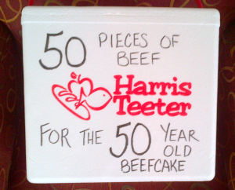

I turned 50 this year; it was…fun.  My back went out twice in the month leading up to the big event, so that was a problem, but I was looking forward to my birthday and had a great time.

We had a sort of meat theme for the weekend that preceded my birthday. We had a big party with a bunch of my friends, family and neighbors. My sister gave me a pound of ground bacon (excellent mixed in with a pound of beef to make burgers), some smoked bacon and a I Love Bacon t-shirt (which I don’t seem to know where it is right now). That was fun.

Two of my neighbors got together and gave me a cooler (photo below) containing 50 pieces of Beef. One of the wives, probably the one with the most OCD walked through the store and carefully counted every piece in every package to make sure the count came out to exactly 50 pieces.

\[caption id="attachment\_2378" align="alignnone" width="300"\] Birthday Meat Cooler\[/caption\]

It was too funny. I got burgers, sausage (beef of course), kielbasa, Bratwurst, ribs and much more. I especially liked the cooler they brought it in. We’ve kept it and every time I look at it I laugh out loud.

My brother and sister came into town for the party, we had a great time together but they’ll never come over on a party weekend again – too much work for them. I told them that going forward, whenever they come in for a party, they can just show up right before the party starts, no need to help with the cooking and so on (although it would be appreciated).  They’re not coming to any other parties I have – I’m calling that now.

One of my best friends (especially now that Bill is no longer with us) flew into town and surprised me at the party. A bunch of us sat on the back porch drinking and talking till late in the night. It was awesome.

We’re in an amazing neighborhood and have made great friends – my birthday was an excellent example of how much fun it is to get everyone together.
