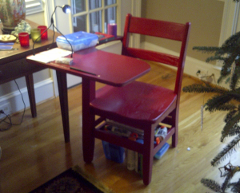

Anna took over my workshop the last month or so – not that I mind. She and a friend got some used school desks and moved them into my workshop to scrape, sand, glue and paint them. The desk undersides were covered with used chewing gum – even I thought it was gross and I didn’t have to scrape it all off. They turned out great, see the picture below of one of them under our Christmas tree.

\[caption id="attachment\_2382" align="alignnone" width="300"\] School Desks\[/caption\]

They took up a bunch of room, of course, but the big effect on me of course is that whenever I’m in the shop working, the kids like to come over and hang out with me, ask a million questions and pick up things I definitely don’t want  them picking up (like sharp pointy things). There wasn’t a place to hide the desks, so I had to keep the door bolted and keep them away from the shop.

On Christmas day, as the kids played with their new toys, I went in and cleaned up from Anna and Nicole’s work. I got everything put back together again and got some of my own stuff put away. Tomorrow and through the rest of the week I’m going to start ripping some plywood I have down there. I’m making new shelves for my CD collection. I’ll take some pictures and share the process with you as I work on them. Stay tuned.
