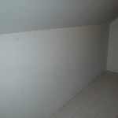
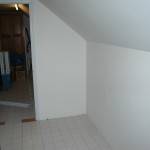

I have a bunch of music CDs. I’ve been collecting them since college and I simply love music. It doesn’t hurt that my best friend worked at a record (CD) store for more than a decade. Many of my discs are promos or ones I bought at a discount, but still – I have a lot of CDs.

Before I got married, I used to keep my CDs on shelves so I could easily access them. After I got married, Anna immediately set about hiding them and they quickly found themselves in drawers (nice drawers, custom made, but drawers none the less).

When we moved to NC, the CDs stayed in boxes until I wanted one (or more) bad enough to dig them out – mostly so I could listen to them in the car. We have a storage room that I’m using for books, music CDs and photos, so the floor was covered with boxes and the shelving had stacks of CDs on them – random CDs I’d pulled out to listen to.

I really want to have access to all of them, so on New Year’s day Anna and I cleaned out the storage room where I’m going to build some shelves. Here are some pictures (below) of the room where I’m going to put the shelves – notice that the wall is sloped, so I only have 55 inches to build my shelves in. Click on the images to view the full photo.

 

I’ve already built one of the shelves, so I’ll mount that one tonight and show you tomorrow how it looks.
