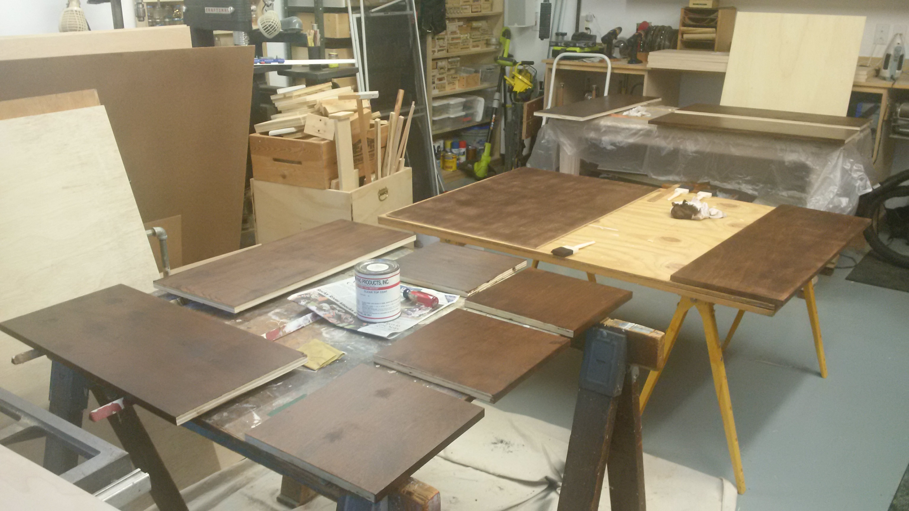
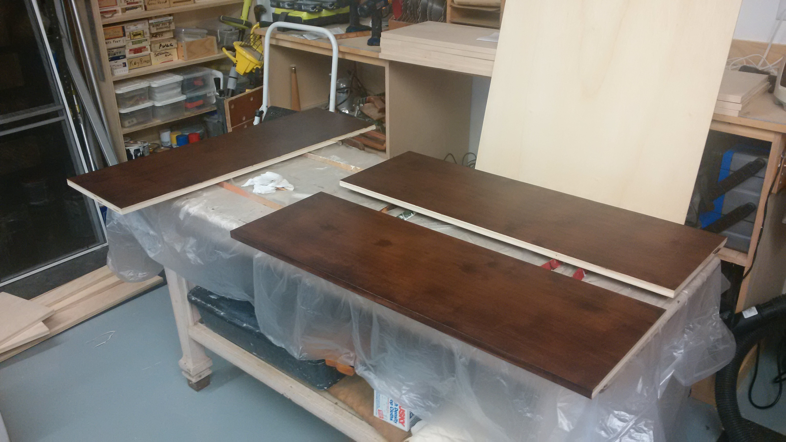
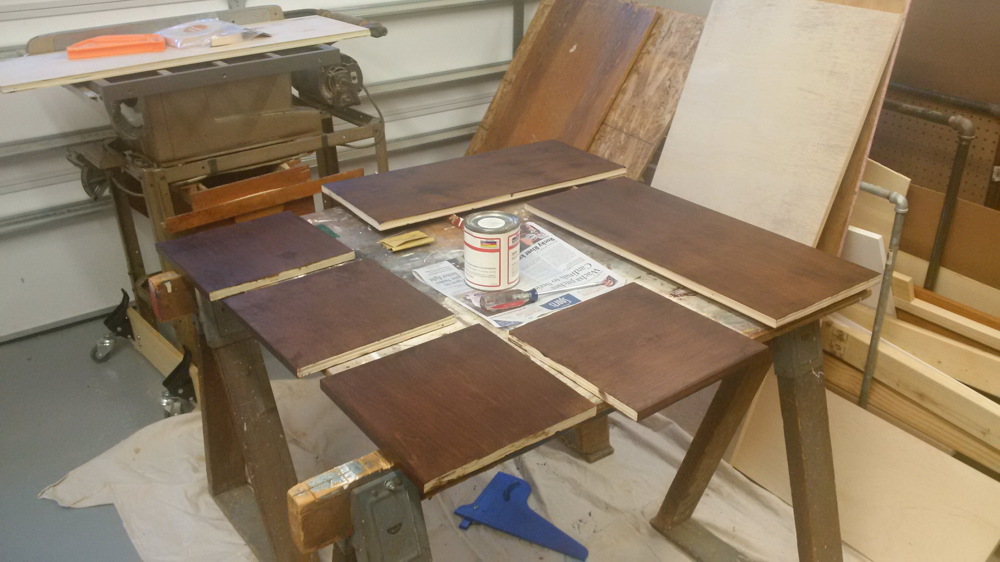

One of the cool things about having a workshop is using it to build stuff. A while back, Anna asked me to put together some shelving for August and Elizabeth's rooms. She wanted something with slots for those collapsible cube storage thingies about 12" by 12" by 12".

Anyway, I got some wood with my friend Sean's help and got to work. I cut all of the wood for August's piece then cut the wood for Elizabeth's next. Elizabeth's is going to be painted and four cubes wide. Augusts has to fit in his room's dormer, so it only has room for three cubes, and Anna wanted something darker. She was going to paint it a dark color, but I can't paint things when a nice finish would look better.

A friend of mine from Akron works for a finish company, not a company from Finland, but a company that produces wood finishes for the furniture industry. He hooked me up with some good stuff. I've almost finished all of the pieces, it was a GREAT learning experience (and a lot of work) but it looks good so far. See the photos below.

