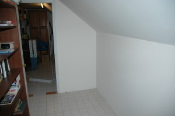
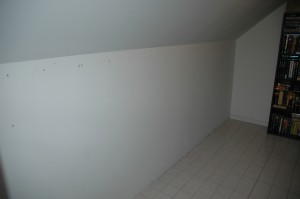
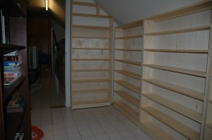
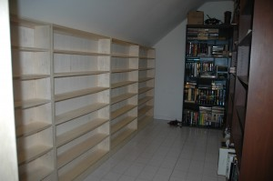
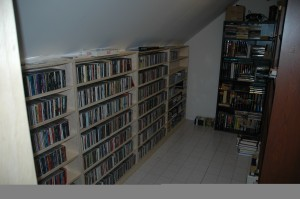

I promised all of you some pictures of how the CD shelves turned out. Here ya go!

Here's the room before I began installation:

 

I cut all of the wood and my friend Jeff Holden helped me put them together and install them in the storage room. Here's the CD Shelves after installation:

And here's the CDs all snuggled into their new home!

