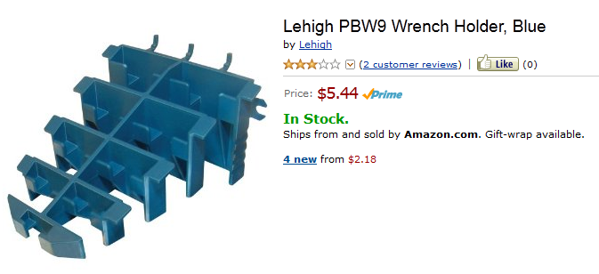
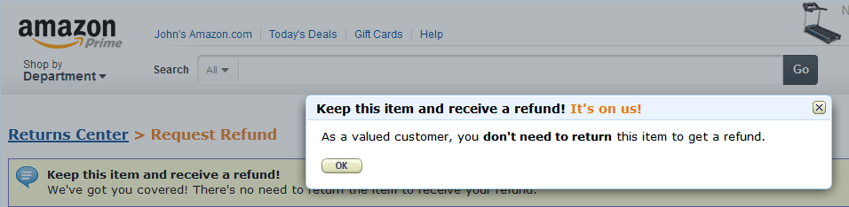

I recently finished unpacking all of my stuff in my workshop. Like my Father did, I built a pegboard storage system behind my bench. As part of my 1st of the year reorganization I was moving some stuff around on the pegboard and decided to pick up some new organizers to hang there. One of the things I got was this interesting pegboard mount for a set of wrenches - see photo below.

\[caption id="attachment\_2436" align="alignnone" width="673"\] Wrench Holder\[/caption\]

When it arrived, I opened it up and attempted to put my wrenches in it. Unfortunately, my Father had mostly Craftsman tools and the Craftsman wrenches won't fit in the holder. Rats.

So, I packaged it back up and went to the Amazon web site to request a return/refund. As I processed the return, I was greeted with the following pop-up:

\[caption id="attachment\_2437" align="alignnone" width="956"\] Amazon Return Dialog\[/caption\]

I was stunned and surprised while at the same time happy to be treated like a valued customer. Now, I know it would cost them more to process the return than to simply allow me to keep the item. I imagine if it was a $100 piece of equipment that they'd certainly want it back.

Anyway, problem solved - anyone need a wrench holder for their shop?
