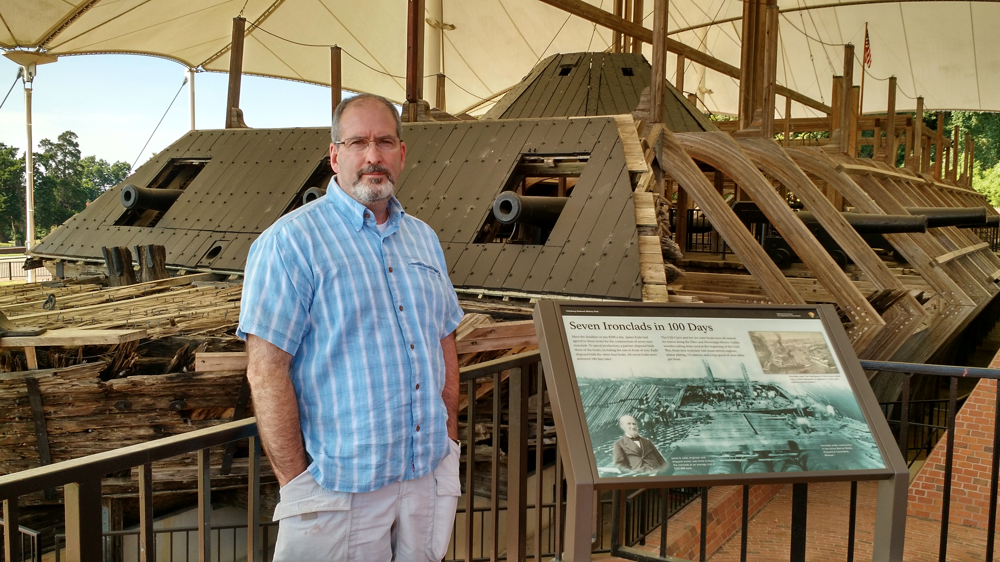
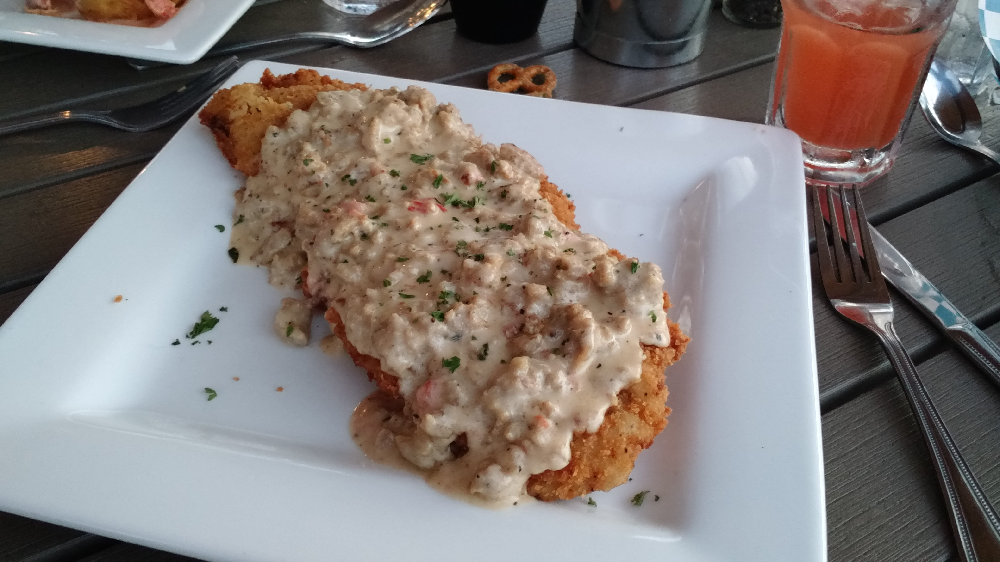

So, since we were only in Greenville, MS to eat at Doe's, we grabbed a hotel room and did some more relaxing. The next morning, I woke up early-ish. I'm a HUGE fan of Shipley's Do-Nuts and spied one in Greenville on the way to the hotel. So, leaving Anna to wake up in the hotel room, I scooted off to get some FRESH Do-Nuts.

My sugar craving satisfied, it was time to begin our day. First we went looking for a greasy spoon diner where we could grab breakfast. The place in downtown Greenville must have been 50 years old and only cleaned once or twice in all those years. Even though I was on vacation, I wasn't allowed to drink caffeine, so I tried to order a decaf coffee at this place – no go, not an option. So, I drank water and had an amazing eggs, sausage and grits breakfast. Probably some of the best grits I've ever had.

After breakfast, we hopped on the road and headed for Vicksburg. I'd paired my phone with our rental car, so we were able to get our navigation instructions and streamed Pandora through the car stereo. Pretty cool.

We arrived in Vicksburg around lunch time and grabbed lunch before heading off to the national park to tour the battlefield (actually, it's basically a seigefield). We visited the welcome center then hired a private guide to take us through the park. I'd read Jeff Shaara's book on the event, so I was pretty well up to speed on what we were looking at, but it was great to have a knowledgeable tour guide. The siegefield wasn't really that interesting as there really wasn't much to see. My favorite part though was the Cairo, an ironclad ship they dug up off of the river bank in the 60's. It was really cool to see the magnitude of what they'd built for this war; the only reason it existed was because it had sunk. All other examples of this type of craft were sold for scrap after the war.

Here's a picture of me with the ship:

And more pictures of the ship:

\[gallery ids="3253,3255,3256"\]

Anyway, we started our tour late, so we wrapped up as they were about to close the park. We decided to come back the next day and see more. Will share some more photos when we get to that part of the vacation.

For our accommodations, Anna booked us a room at Anchuca, an Antebellum home in Vicksburg. We stayed in the carriage house and had a beautiful, updated, cool and comfortable room for the night.

For dinner, we ate at a place called 10 South, a restaurant on the top (10th) floor of a building overlooking the Mississippi river. It was hot, but way cool. For my meal, I had country fried steak (no surprise there) made out of a New York Strip, see phot below. It was awesome! I couldn't eat all of it.

When we got back to our room, we grabbed a cocktail and a quick swim in the facility's pool. In all, it was a fun, although unconventional, romantic vacation day.
