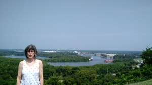
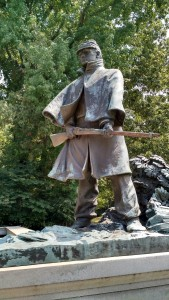
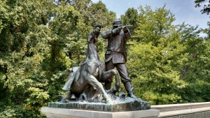
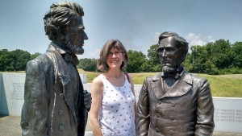
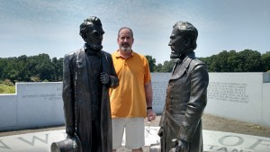

Day three of our vacation started with a great breakfast at Anchuca followed by a tour of the building. I'd not spent much time in any buildings built before the civil war, so it was fun.

We didn't have enough time to visit the Cairo before the park closed, so we headed over to the park right after breakfast to see more. There are park ranger talks on the hour (or so), and we were the only ones there, so we had a nice, 30 minute chat with a very knowledgeable park ranger. After that, we drove around the park again, taking extra time to visit many of the monuments close-up, here are some pictures we took during that particular tour.

  

There was a cool monument from Kentucky that had life size statues (I think) of Abraham Lincoln and Jefferson Davis. Notice how we aligned with our partisan presidents.

 

Next we visited the Biedenharn Coca-Cola Museum ([http://www.biedenharncoca-colamuseum.com/about.htm](http://www.biedenharncoca-colamuseum.com/about.htm)), the place where Coca Cola was first bottled. It was not worth the price of admission, but we were on vacation so felt the need to do something vacationny. We'd hoped to buy the kids some cool souvenirs from the museum, but they didn't have anything interesting.

After the museum, we grabbed lunch and spent some time walking around Vicksburg doing some shopping. Anna's sister had a birthday (that day as a matter of fact) and my sister's birthday was a little earlier, so we bought gifts for both of them.

We were staying in Natchez that night, so we headed that way, stopping at the Windsor Ruins ([https://en.wikipedia.org/wiki/Windsor\_Ruins](https://en.wikipedia.org/wiki/Windsor_Ruins)) on the way. Here's some pics.

\[gallery ids="3271,3272,3273,3274,3275"\]

We drove on the Natchez trace most of the way there and that was a really cool road. We made it to Natchez and stayed at a bed and breakfast that neither of us really enjoyed. It was a nice place, but I'm not into rustic, old bed and breakfasts. The innkeeper tried so hard to give us a good experience, but it was just not fun. Ask us about it some time, we'll have stories for you.

Not much more to say about this day, sorry.
