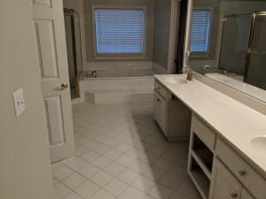
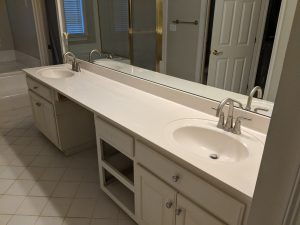
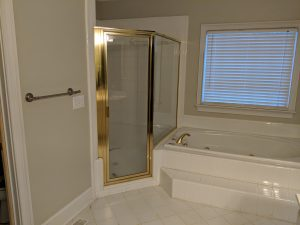
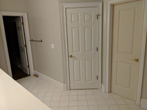
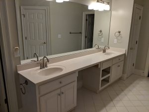

A few weeks ago, we started a complete remodel of our master bathroom. Our master bathroom was unchanged from when the house was built back in 1999, and it really needed a refit. It had this basic, plain white tile everywhere with a really ugly counter top and mismatch of plumbing fixtures and trim. Here's some pictures of the bathroom right before demolition.

    
