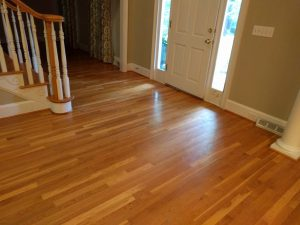
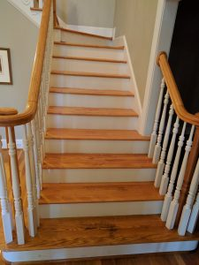
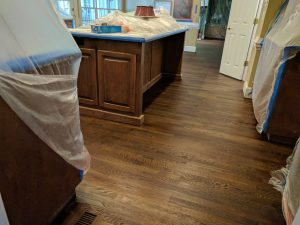
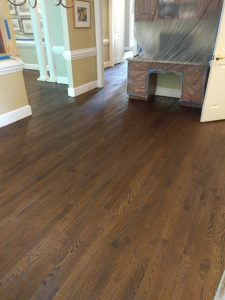

If you've been to our house, you likely noticed our yellow hardwood floors. Whoever built the house used a clear finish on unstained floors that over time yellowed. Not a good look.

Here's what they looked like:

 

Our master bedroom was carpeted, while the rest of the first floor was hardwoods, so we decided to pull out the carpet and install new hardwoods in the bedroom. As part of that, we had the whole first floor refinished in a darker color - it looks much nicer now. Check them out.

 
